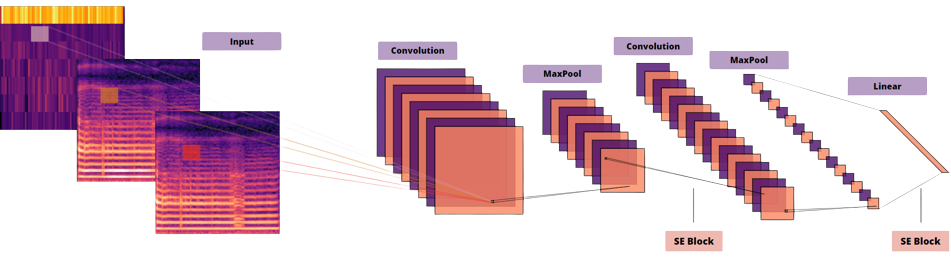

    <h2>Repository for research on the usability of CNNs in speech processing (health-focused).</h2> 

    

Data used in the study so far:
<ul>
  <li>Cardiovascular diseases - private repository</li>
  <li>Woldert-Jokisz, Bogdan. “Saarbruecken Voice Database.” (2007).</li>
  <li>U. Cesari, G. De Pietro, E. Marciano, C. Niri, G. Sannino, and L. Verde. A new database of healthy and pathological voices. Computers & Electrical Engineering, vol. 68, pp. 310-321, 5 2018.
  Goldberger AL, Amaral LAN, Glass L, Hausdorff JM, Ivanov PCh, Mark RG, Mietus JE, Moody GB, Peng C-K, Stanley HE. PhysioBank, PhysioToolkit, and PhysioNet: Components of a New Research Resource for Complex Physiologic Signals. Circulation 101(23):e215-e220 [Circulation Electronic Pages; http://circ.ahajournals.org/cgi/content/full/101/23/e215]; 2000 (June 13).
  </li>
</ul>

